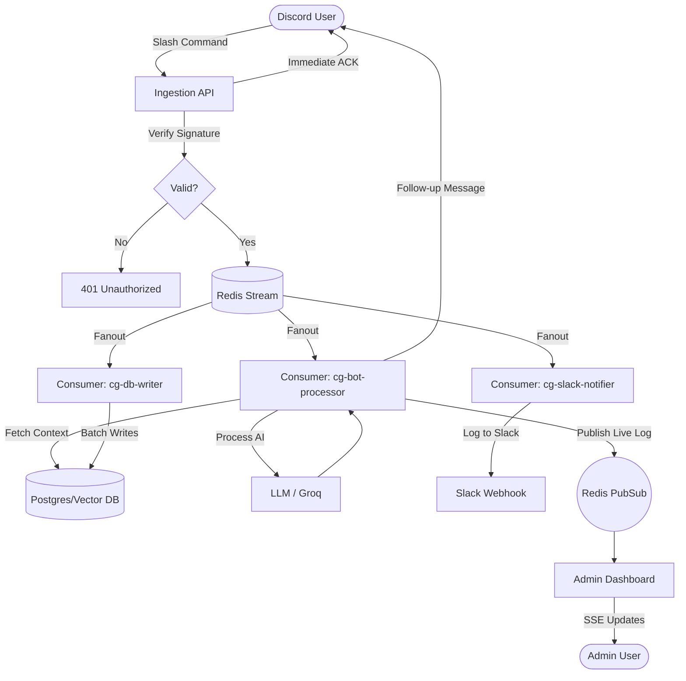

# Automate — Discord Bot + Dashboard

A production-grade Discord bot interaction system built with Next.js, TypeScript, Neon Postgres, and Redis Streams. Features an admin dashboard, fanout architecture, and full observability.

## Architecture



## Monorepo Structure

```
automate/
├── apps/
│   ├── ingestion/     # Discord interactions endpoint
│   ├── bot/           # Queue consumer + fanout worker
│   └── dashboard/     # Admin web UI
└── packages/
    ├── types/         # Shared TypeScript types (no `any`)
    ├── db/            # Prisma 6.6 + Neon Postgres client
    └── redis/         # ioredis + Redis Streams utilities
```

## Local Development

### Prerequisites
- Node.js >= 24
- Bun >= 1.3

- A running Redis instance (Upstash, local Docker, etc.)
- A Neon Postgres connection string

### Setup

```bash
git clone <your-repo>
cd automate

# Copy env and fill in your secrets
cp .env.example .env
# Edit .env with your keys (Discord token, Neon Postgres URL, etc.)
```

### Running Locally (Docker Compose)

The easiest way to run the entire stack locally is using Docker Compose. This spins up Redis and all 3 Next.js/Express services automatically.

```bash
docker-compose up --build
```

Services will start at:
- **Dashboard**: http://localhost:3000
- **Ingestion**: http://localhost:3001/api/interactions
- **Bot Worker**: http://localhost:3002/api/worker

### Running Locally with Cloudflare Tunnel

To run the full stack locally and expose your ingestion endpoint securely to Discord, use the tunnel setup:

1. Create a Cloudflare Tunnel and copy the token.
2. Add the token to your `.env` as `CLOUDFLARE_TUNNEL_TOKEN`.
3. In your Cloudflare Zero Trust Dashboard, route your public hostname to `http://ingestion:3001`.
4. Start the stack with the tunnel included:
   ```bash
   docker-compose -f docker-compose.yml -f docker-compose.tunnel.yml up --build
   ```
5. Set your **Discord Interactions Endpoint URL** to your Cloudflare Tunnel URL (e.g., `https://api.yourdomain.com/api/interactions`).

### Running Locally (Native Bun)

Alternatively, you can run the services natively:

```bash
# Install dependencies
bun install

# Generate Prisma client
bun run db:generate

# Push schema if needed
bun run db:push

# Run all services concurrently
bun run dev
```

### Seed Admin User

```bash
# Run this one-time script to create an admin account
# (You'll need to hash the password with bcrypt first)
node -e "require('bcryptjs').hash('yourpassword', 12).then(h => console.log(h))"
# Then insert into DB:
# INSERT INTO "AdminUser" (id, email, "passwordHash", "createdAt")
# VALUES (gen_random_uuid(), 'admin@example.com', '<hash>', now());
```

### Seed Postgres & Vector DB with Mock Data

The AI relies on context data stored in the database. You must run the seed script to populate fertilizer factory data:

```bash
cd apps/bot
bun run src/scripts/seed-fertilizers.ts
```

## Environment Variables

See [`.env.example`](.env.example) for all required variables with documentation.

## Bot Setup Guide

### 1. Discord Bot Setup
1. Go to the [Discord Developer Portal](https://discord.com/developers/applications).
2. Create a New Application.
3. In **General Information**, copy your **Public Key** and add it to your `.env` as `DISCORD_PUBLIC_KEY`.
4. In **Bot**, click "Reset Token", copy it, and add it to `.env` as `DISCORD_TOKEN`.
5. Under **OAuth2 > URL Generator**:
   - Check the `bot` and `applications.commands` scopes.
   - For bot permissions, select permissions necessary for your use case (e.g., Send Messages).
   - Use the generated URL to invite the bot to your server.
6. Once deployed via Cloudflare Tunnel or Vercel, paste your public URL into the **Interactions Endpoint URL** field (e.g., `https://your-tunnel-url/api/interactions`).

### 2. Slack Webhook Setup
The bot can mirror certain interactions/logs to Slack.
1. Create a Slack App in your workspace.
2. Enable **Incoming Webhooks**.
3. Create a new webhook for a specific channel.
4. Copy the Webhook URL and add it to your `.env` as `SLACK_WEBHOOK_URL`.

## Deployment (Vercel)

This monorepo uses Vercel for hosting. Because some apps are standard Express servers (`bot`, `ingestion`, `api`) and others are Next.js (`dashboard`), they require different deployment strategies.

**Crucial Deployment Settings for Express Apps (Docker/Container):**
When deploying `apps/bot`, `apps/ingestion`, or `apps/api` to Vercel using the "Container" option, you MUST:
1. Set the **Root Directory** to `/` (the root of the GitHub repository). *Do NOT set it to the app folder.*
2. Set the **Dockerfile** path to the specific app (e.g., `apps/api/Dockerfile`). 

*Why?* Turbo Prune runs from the Dockerfile and needs access to the entire monorepo context (`bun.lock`, root `package.json`, etc.) to correctly prune and build shared packages (`@repo/db`, etc.).

| App | Type | Vercel Root Directory | Vercel Framework Preset |
|---|---|---|---|
| `dashboard` | Next.js | `apps/dashboard` | Next.js |
| `api` | Express | `/` (repo root) | Docker/Container (`apps/api/Dockerfile`) |
| `bot` | Express | `/` (repo root) | Docker/Container (`apps/bot/Dockerfile`) |
| `ingestion` | Express | `/` (repo root) | Docker/Container (`apps/ingestion/Dockerfile`) |

In the Discord Developer Portal, set your **Interactions Endpoint URL** to:
```
https://<your-ingestion-url>.vercel.app/api/interactions
```

## Slash Commands

Register commands via the Discord Developer Portal or using the REST API:

| Command | Description |
|---|---|
| `/report <text>` | Submit a report |
| `/status` | Check bot status |
| `/ask prompt:<text>` | Ask a question (context-aware AI response) |

## Quality Guarantees

- ✅ **Ed25519 verification** on every request
- ✅ **Deduplication** via Redis NX key (24h TTL)
- ✅ **<3s ACK** — deferred response, async processing
- ✅ **Fanout with retry** (exponential backoff, 5 attempts)
- ✅ **DLQ** via Redis Streams for failed events
- ✅ **No secrets** in code, logs, or client

## Tech Stack

- **Framework**: Express.js (backend), Next.js 15 (frontend)
- **Language**: TypeScript (strict, no `any`)
- **Package Manager**: Bun
- **ORM**: Prisma 6.6.0
- **Database**: Neon (Postgres)
- **Queue**: Redis Streams via ioredis
- **Auth**: JWT via `jose`
- **Deployment**: Vercel (Serverless & Containers)

## Important Operational Notes

- **Alpine & SSL**: The `bot` container runs on `alpine`. Make sure `ca-certificates` are installed in the runner stage of the Dockerfile so that node/bun can securely connect to external AI APIs without `UNKNOWN_CERTIFICATE_VERIFICATION_ERROR`.
- **Discord Follow-ups**: The bot uses a two-message architecture for interactions. It sends an instant `✅ /command received` follow-up to resolve the interaction, and then a second `🤖 AI Response:` follow-up message when the AI finishes its generation.
